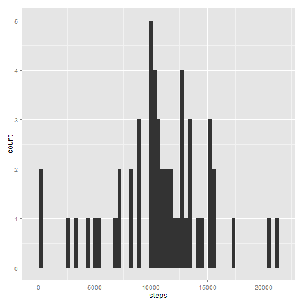
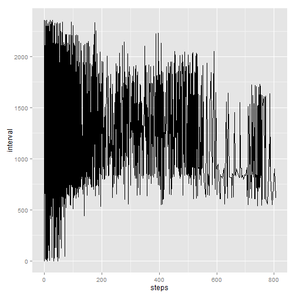
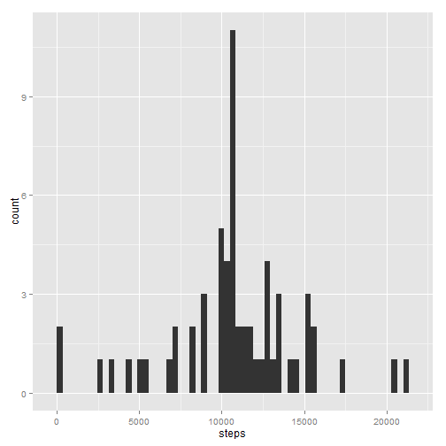
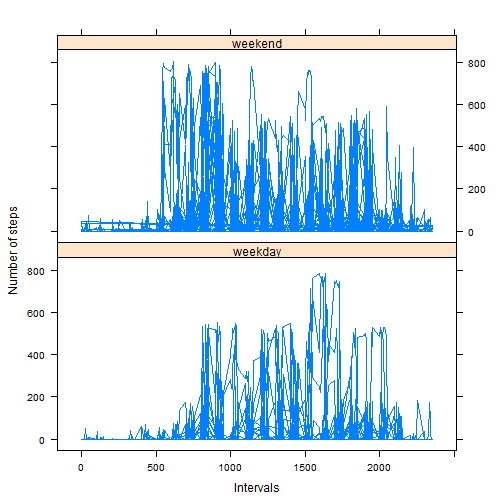

# Reproducible Research: Peer Assessment 1

## Loading and preprocessing the data


```r
if(!file.exists('Source_Classification_Code.rds') || !file.exists('summarySCC_PM25.rds')){
# Check if the power consumption zip file already exists in the root directory , if not download it from internet

if(!file.exists('repdata_data_activity.zip')){

download.file("https://d396qusza40orc.cloudfront.net/repdata%2Fdata%2Factivity.zip","./repdata_data_activity.zip")
}

#unzip the contents of the downloaded zip file
unzip("repdata_data_activity.zip")
activity <- read.csv("activity.csv")
}
ativity <- activity[complete.cases(activity),]
stepscount <- aggregate(steps ~ date, activity, sum)
```

## What is mean total number of steps taken per day?

1. Histogram for total number of steps taken each day
  

```r
library(ggplot2)
ggplot(stepscount, aes(x=steps)) + geom_histogram(binwidth = 350)  
```

 

2. Mean total number of steps taken per day


```r
median(stepscount$steps)
```

```
## [1] 10765
```

3. Median total number of steps taken per day


```r
median(stepscount$steps)
```

```
## [1] 10765
```

## What is the average daily activity pattern?


 1. A time series plot of the 5-minute interval (x-axis) and the average number of steps taken, averaged across all days (y-axis)
 

```r
library(ggplot2)
ggplot(activity, aes(x = steps, y = interval))  + 
geom_line() 
```

```
## Warning: Removed 2304 rows containing missing values (geom_path).
```

 

2.The 5-minute interval that on average across all the days in the dataset, contains the maximum number of steps

```r
intervalcount <- aggregate(steps ~ interval, activity, sum)

intervalcount$interval[which(intervalcount$steps == max(intervalcount[,2]))]
```

```
## [1] 835
```

## Imputing missing values


1. Total Number of Missing Values

```r
nrow(activity[!complete.cases(activity),])
```

```
## [1] 2304
```
2. Filling in all of the missing values in the dataset using mean for corresponding 5 minute interval


```r
intervalMeans <- aggregate(steps ~ interval, activity, mean)
activityNACases <- activity[which(is.na(activity)),]
naIdx <- which(is.na(activity[, 1])==TRUE)
newActivity <- activity
for (i in naIdx ){ newActivity$steps[i] <- intervalMeans$steps[which(intervalMeans$interval == newActivity$interval[i])]}
```
3. New Dataset with the name of newActivity is created that has all the data set to NA filled up with mean of corresponding 5 minute interval

4-1. Histogram for total number of steps taken each day on the new dataset with missing data filled in


```r
newStepscount <- aggregate(steps ~ date, newActivity, sum)
library(ggplot2)
ggplot(newStepscount, aes(x=steps)) + geom_histogram(binwidth = 350)  
```

 

4-2. Mean total number of steps taken per day on the new dataset with missing data filled in


```r
median(newStepscount$steps, na.rm = TRUE)
```

```
## [1] 10766
```

4-3. Median total number of steps taken per day on the new dataset with missing data filled in


```r
median(newStepscount$steps, na.rm = TRUE)
```

```
## [1] 10766
```


## Are there differences in activity patterns between weekdays and weekends?


1. Introduced a new factor variable in the dataset with two levels – “weekday” and “weekend” indicating whether a given date is a weekday or weekend day


```r
date <- as.POSIXlt(activity$date,format="%Y-%m-%d")
activity$dayOfWeek <- !(weekdays(as.Date(date)) %in% c('Saturday','Sunday'))
weekdayFactor <- factor(activity$dayOfWeek, labels = c("weekday", "weekend"))
```

2. A panel plot containing a time series plot of the 5-minute interval (x-axis) and the average number of steps taken, averaged across all weekday days or weekend days (y-axis). 


```r
library(lattice)
 xyplot(activity$steps ~ activity$interval | weekdayFactor, data = activity, layout = c(1, 2),type='l',xlab="Intervals",ylab ="Number of steps")
```

 
